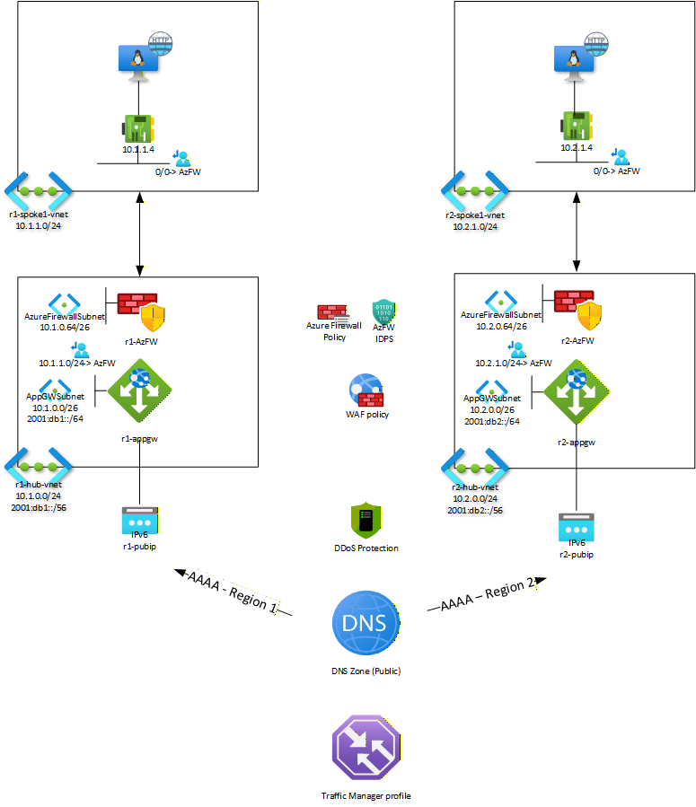

# Delivering web applications over IPv6

The unallocated IPv4 address space pool has been exhausted for some time now, meaning there is no new public address space available for allocation from Internet Registries. The internet continues to run on IPv4 through technical measures such as Network Address Translation (NAT) and [Carrier Grade NAT](https://en.wikipedia.org/wiki/Carrier-grade_NAT), and reallocation of address space through [IPv4 address space trading](https://iptrading.com/). 

Despite the depletion of free IPv4 address space, adoption of IPv6 - with its almost infinitely larger address space the definitive solution to the address space depletion problem - has been slow. [Uptake of IPv6 in the European Union](https://op.europa.eu/en/publication-detail/-/publication/4fcbb7eb-b05e-11ef-acb1-01aa75ed71a1) in Q3 of 2024 stood at appr. 36% for clients (end-users) and 23% for (web) servers over all member states - although there are variations between states. Globally, [Google](https://www.google.com/intl/en/ipv6/statistics.html#tab=ipv6-adoption) reports 49% of clients connecting to its services over IPv6 globally, with France leading at 80%. 

IPv6 client access measured by Google:

Ultimately IPv6 will be the dominant network protocol on the internet, as the IPv4 life-support mechanisms used by network operators, hosting providers and ISPs will eventually reach the limits of their scalability.

Meanwhile, countries around the world are requiring IPv6 reachability for public web services. Examples are [the United States](https://www.whitehouse.gov/wp-content/uploads/2020/11/M-21-07.pdf), European Union member states among which [the Netherlands](https://www.forumstandaardisatie.nl/ipv6), [Norway](https://lovdata.no/dokument/SF/forskrift/2013-04-05-959#shareModal), [India](https://dot.gov.in/ipv6-transition-across-stakeholders), Japan.

IPv6 adoption per country measured by Google:

 Entities needing to comply with these mandates are looking at Azure's networking capabilities for solutions. Azure supports IPv6 for both private and public networking, and capabilities have developed and expanded over time. This article discusses strategies to build and deploy IPv6-enabled public, internet-facing applications that are reachable from IPv6(-only) clients.

## Azure Networking IPv6 capabilities 
Azure's private networking capabilities center on Virtual Networks (VNETs) and the components that are deployed within. Azure VNETs are [IPv4/IPv6 dual stack](https://learn.microsoft.com/en-us/azure/virtual-network/ip-services/ipv6-overview) capable: a VNET **must** always have IPv4 address space allocated, and **can** have also IPv6 address space. Virtual machines in a dual stack VNET will have both an IPv4 and an IPv6 address from the VNET range, and can be behind IPv6 capable External- and Internal Load Balancers.  VNETs can be connected through VNET peering, which effectively turns the peered VNETs into a single routing domain. It is now possible to peer only the IPv6 address spaces of VNETs, so that the IPv4 space assigned to VNETs can overlap and communication across the peering is over IPv6. The same is true for connectivity to onpremise over ExpressRoute: the Private Peering can be enabled for IPv6 only, so that VNETs in Azure do not have to have unique IPv4 address space assigned, which may be in short supply in an enterprise.

Not all internal networking components are IPv6 capable yet. Most notable exceptions are VPN Gateway, Azure Firewall and Virtual WAN; IPv6 compatibility is on the roadmap for these services, but target availability dates have not been communicated.

But now let's focus on Azure's externally facing, public, network services. Azure is ready to let customers publish their web applications over IPv6.

 IPv6 capable externally facing network services include:
- [Azure Front Door](https://learn.microsoft.com/en-us/azure/frontdoor/front-door-overview#global-delivery-scale-using-microsofts-network)
- [Application Gateway](https://learn.microsoft.com/en-us/azure/application-gateway/ipv6-application-gateway-portal)
- [External Load Balancer](https://learn.microsoft.com/en-us/azure/load-balancer/deploy-ipv4-ipv6-dual-stack-standard-load-balancer?tabs=azurecli)
- [Public IP addresses](https://learn.microsoft.com/en-us/azure/virtual-network/ip-services/public-ip-addresses#ip-address-version) and [Public IP address prefixes](https://learn.microsoft.com/en-us/azure/virtual-network/ip-services/public-ip-address-prefix)
- [Azure DNS](https://learn.microsoft.com/en-us/azure/dns/dns-faq#do-azure-dns-name-servers-resolve-over-ipv6--)
- [Azure DDOS Protection](https://learn.microsoft.com/en-us/azure/ddos-protection/ddos-protection-sku-comparison#tiers)
- [Traffic Manager](https://learn.microsoft.com/en-us/azure/traffic-manager/traffic-manager-faqs#does-traffic-manager-support-ipv6-endpoints)
- [App Service](https://azure.github.io/AppService/2024/11/08/Announcing-Inbound-IPv6-support.html) (IPv6 support is in public preview)

Below I will discuss patterns to publish applications over IPv6 using (combinations of) these services.

## IPv6 Application Delivery 

**IPv6 Application Delivery** refers to the architectures and services that enable your web application to be accessible via IPv6. The goal is to provide an IPv6 address and connectivity for clients, while often continuing to run your application on IPv4 internally (dual-stack). Azure’s dual-stack capabilities allow an application to be reachable on both IPv4 and IPv6 without completely re-building your network for IPv6.

Key benefits of adopting IPv6 in Azure include:

✅ **Expanded Client Reach:** *IPv4-only websites risk being unreachable to IPv6-only networks.* By enabling IPv6, you expand your reach into growing mobile and IoT markets that use IPv6 by default. Governments and enterprises increasingly mandate IPv6 support for public-facing services.

✅**Address Abundance & No NAT:** IPv6 provides a virtually unlimited address pool, mitigating IPv4 exhaustion concerns. This abundance means each service can have its own public IPv6 address, often removing the need for complex NAT schemes. End-to-end addressing can simplify connectivity and troubleshooting.

✅**Dual-Stack Compatibility:** Azure supports dual-stack deployments where services listen on both IPv4 and IPv6. This allows a single application instance or endpoint to serve both types of clients seamlessly. Dual-stack ensures you don’t lose any existing IPv4 users while adding IPv6 capability.

✅**Performance and Future Services:** Some networks and clients might experience better performance over IPv6 (due to less NAT). Also, being IPv6-ready prepares your architecture for future Azure features and services as IPv6 integration deepens across the platform.

**General Steps to Enable IPv6 Connectivity** for a web application in Azure are:
1. **Plan and Enable IPv6 Addressing in Azure**: Define an IPv6 address space in your Azure Virtual Network. Azure allows adding IPv6 address space to existing VNETs, making them dual-stack. A `/56` segment for the VNet is recommended, `/64` for subnets is required (Azure *requires* `/64` subnets). If you have existing infrastructure, you might need to create new subnets or migrate resources, especially since older [Application Gateway v1 instances cannot simply be “upgraded” to dual-stack](https://learn.microsoft.com/en-us/azure/application-gateway/application-gateway-faq#does-application-gateway-support-ipv6).
2. **Deploy or Update Frontend Services with IPv6**: Choose a suitable Azure service (Application Gateway, External / Global Load Balancer, etc.) and configure it with a public IPv6 address on the frontend. This usually means selecting *Dual Stack* configuration so the service gets both an IPv4 and IPv6 public IP. For instance, when creating an Application Gateway v2, you would specify [IP address type: DualStack (IPv4 & IPv6)](https://learn.microsoft.com/en-us/azure/application-gateway/ipv6-application-gateway-portal). Azure Front Door [by default](https://learn.microsoft.com/en-us/azure/frontdoor/front-door-overview) provides dual-stack capabilities with its global endpoints.
5. **Configure Backends and Routing**: Usually your backend servers or services will remain on IPv4. At the time of writing this in October 2025, neither Azure Application Gateway nor Azure Front Door not support IPv6 for backend pool addresses. This is fine because the frontend terminates the IPv6 network connection from the client, and the backend initiates an IPv4 connection to the backend pool or origin. Ensure that your load balancing rules, listener configurations, and health probes are all set up to route traffic to these backends. Both IPv4 and IPv6 frontend listeners can share the same backend pool.
6. **Update DNS Records**: Publish a DNS **AAAA record** for your application’s host name, pointing to the new IPv6 address. This step is critical so that IPv6-only clients can discover the IPv6 address of your service. If your service also has an IPv4 address (dual stack), you will have both [A (IPv4) and AAAA (IPv6) records](https://learn.microsoft.com/en-us/azure/dns/dns-zones-records#record-types) for the same host name. DNS will thus allow clients of either IP family to connect. (In multi-region scenarios using Traffic Manager or Front Door, DNS configuration might be handled through those services as discussed later.)
7. **Test IPv6 Connectivity**: Once set up, test from an IPv6-enabled network or use online tools to ensure the site is reachable via IPv6. Azure’s services like Application Gateway and Front Door will handle the dual-stack routing, but it’s good to verify that content loads on an IPv6-only connection and that SSL certificates, etc., work over IPv6 as they do for IPv4.

Next, we explore specific Azure services and architectures for IPv6 web delivery in detail.

### External Load Balancer - single region

Azure External Load Balancer (also known as Standard Load Balancer) can be deployed in a single region to provide IPv6 access to applications running on virtual machines or VM scale sets. In a single-region setup, **External Load Balancer acts as a Layer 4 entry point** for IPv6 traffic, distributing connections across backend instances. This scenario is ideal when you have stateless applications or services that don't require Layer 7 features like SSL termination or path-based routing.

**Key IPv6 Features of External Load Balancer**: 
- **Dual-Stack Frontend:** Standard Load Balancer supports both [IPv4 and IPv6 frontends](https://learn.microsoft.com/en-us/azure/load-balancer/load-balancer-ipv6-overview) simultaneously. When configured as dual-stack, the load balancer gets two public IP addresses – one IPv4 and one IPv6 – and can distribute traffic from both IP families to the same backend pool.
- **Zone-Redundant by Default:** Standard Load Balancer is zone-redundant by default, providing high availability across Azure Availability Zones within a region without additional configuration.
- **IPv6 Frontend Availability:** IPv6 support in Standard Load Balancer is available in all Azure regions. Basic Load Balancer does *not* support IPv6, so you must use Standard SKU.
- **IPv6 Backend Pool Support:** While the frontend accepts IPv6 traffic, the load balancer will **not** translate IPv6 to IPv4. Backend pool members (VMs) must have private IPv6 addresses. You will need to add private IPv6 addressing to your existing VM IPv4-only infrastructure. This is in contrast to Application Gateway, discussed below, which will terminate inbound IPv6 network sessions and connect to the backend-end over IPv4.
- **Protocol Support:** Supports TCP and UDP load balancing over IPv6, making it suitable for web applications, APIs, and other TCP-based services accessed by IPv6-only clients.

**Single Region Deployment Steps:** To set up an IPv6-capable External Load Balancer in one region, follow this high-level process:

1. **Enable IPv6 on the Virtual Network:** Ensure the VNET where your backend VMs reside has an IPv6 address space. Add a dual-stack address space to the VNET (e.g., add an IPv6 space like 2001:db8:1234::/56 to complement your existing IPv4 space). Configure subnets that are dual-stack, containing both IPv4 and IPv6 prefixes (/64 for IPv6).
2. **Create Standard Load Balancer with IPv6 Frontend:** In the Azure Portal, create a new **Standard Load Balancer**. During creation, configure the frontend IP with both IPv4 and IPv6 public IP addresses. Create or select existing Standard SKU public IP resources – one for IPv4 and one for IPv6. The IPv6 public IP will be automatically zone-redundant.
3. **Configure Backend Pool:** Add your virtual machines or VM scale set instances to the backend pool. Note that your backend instances will need to have private IPv6 addresses, in addition to IPv4 addresses, to receive inbound IPv6 traffic via the load balancer.
4. **Set Up Load Balancing Rules:** Create load balancing rules that map frontend ports to backend ports. For web applications, typically map port 80 (HTTP) and 443 (HTTPS) from both the IPv4 and IPv6 frontends to the corresponding backend ports. Configure health probes to ensure only healthy instances receive traffic.
5. **Configure Network Security Groups:** Ensure an NSG is present on the backend VM's subnet, allowing inbound traffic from the internet to the port(s) of the web application. Inbound traffic is "secure by default" meaning that inbound connectivity from internet is blocked unless there is an NSG present that explicitly allows it.
6. **DNS Configuration:** Create DNS records for your application: an **A record** pointing to the IPv4 address and an **AAAA record** pointing to the IPv6 address of the load balancer frontend.

**Outcome:** In this single-region scenario, IPv6-only clients will resolve your application's hostname to an IPv6 address and connect to the External Load Balancer over IPv6. The load balancer then distributes this traffic across your backend VMs over IPv4 internally. This approach **requires no changes to your application code or VM configuration** – only the network frontend gains IPv6 capability.

**Example:** Consider a web application running on a VM scale set behind an External Load Balancer in East US. The scale set VMs run your containerized application on port 8080 internally. To enable IPv6, you add IPv6 address space to the VNet, configure the load balancer with an IPv6 frontend IP (e.g., `2603:1030:1005:3::5a`), and create load balancing rules mapping port 80 on the IPv6 frontend to port 8080 on the backend VMs. You then create a DNS AAAA record for `api.contoso.com` pointing to that IPv6 address. Now IPv6-only mobile clients can successfully access your API because their DNS queries return the IPv6 address, and the Azure External Load Balancer listens on that address to distribute requests across your scale set.

**Limitations & Considerations:**
- *Standard SKU Required:* Basic Load Balancer does not support IPv6. You must use Standard Load Balancer, which has different pricing and capabilities.
- *Layer 4 Only:* Unlike Application Gateway, External Load Balancer operates at Layer 4 (transport layer). It cannot perform SSL termination, cookie-based session affinity, or path-based routing. If you need these features, consider Application Gateway instead.
- *Dual stack IPv4/IPv6 Backend requireds:* Backend pool members must have private IPv6 addresses to receive inbound IPv6 traffic via the load balancer. The load balancer does not translate between the IPv6 frontend and an IPv4 backend.
- *Outbound Connectivity:* If your backend VMs need outbound internet access over IPv6, you'll need to configure outbound rules or use NAT Gateway with IPv6 support (when available). Standard Load Balancer provides outbound SNAT for IPv4 but IPv6 outbound connectivity has different requirements.
- *Monitoring and Diagnostics:* The load balancer will log connections from IPv6 clients in Azure Monitor metrics and diagnostic logs. Ensure your monitoring solutions can parse and display IPv6 addresses correctly.

### Global Load Balancer - multi-region

Azure Global Load Balancer (also known as Cross-Region Load Balancer) provides a cloud-native global network load balancing solution for distributing traffic across multiple Azure regions with ultra-low latency and high performance. Unlike DNS-based solutions, **Global Load Balancer uses anycast IP addressing** to automatically route IPv6 clients to the nearest healthy regional deployment through Microsoft's global network backbone.

**Key IPv6 Features of Global Load Balancer:**
- **Static Anycast Global IP:** Global Load Balancer provides a single static public IP address (both IPv4 and IPv6 supported) that is advertised from multiple Azure regions globally. This anycast address ensures clients always connect to the nearest available region without requiring DNS resolution.
- **Geo-Proximity Routing:** Traffic is intelligently routed based on the geographic location of users and regional deployments. When an IPv6 client connects, traffic automatically enters the closest participating Azure region and travels through Microsoft's global network backbone to reach the optimal regional deployment.
- **Ultra-Low Latency:** The geo-proximity load-balancing algorithm minimizes latency by directing traffic to the nearest region. Unlike DNS-based routing, there's no DNS lookup delay - clients connect directly to the anycast IP and are immediately routed to the best region.
- **Layer 4 Pass-Through:** Global Load Balancer operates as a Layer 4 pass-through network load balancer, preserving the original client IP address (including IPv6 addresses) for backend applications to use in their logic.
- **Regional Redundancy:** If one region fails, traffic is automatically routed to the next closest healthy regional load balancer within seconds, providing instant global failover without DNS propagation delays.

**Architecture Overview:** Global Load Balancer sits in front of multiple regional Standard Load Balancers, each deployed in different Azure regions. Each regional load balancer serves a local deployment of your application with IPv6 frontends. The global load balancer provides a single anycast IP address that clients worldwide can use to access your application, with automatic routing to the nearest healthy region.

**Multi-Region Deployment Steps:**

1. **Deploy Regional Load Balancers**: Create Standard External Load Balancers in multiple Azure regions (e.g., East US, West Europe, Southeast Asia). Configure each with dual-stack frontends (IPv4 and IPv6 public IPs) and connect them to regional VM deployments or VM scale sets running your application.

2. **Create Global Load Balancer**: Deploy the Global Load Balancer in one of the supported [home regions](https://learn.microsoft.com/en-us/azure/load-balancer/cross-region-overview#home-regions-in-azure) (such as East US, West Europe, or North Europe). The home region only affects where the global load balancer resource is deployed - it doesn't impact traffic routing.

3. **Configure Global Frontend**: Create a Global tier public IP address (IPv6 supported) for the frontend. This becomes your application's global anycast address that will be advertised from participating regions worldwide.

4. **Add Regional Backends**: Configure the backend pool of the global load balancer to include your regional Standard Load Balancers. Each regional load balancer becomes an endpoint in the global backend pool. The global load balancer automatically monitors the health of each regional endpoint.

5. **Set Up Load Balancing Rules**: Create load balancing rules mapping frontend ports to backend ports. For web applications, typically map port 80 (HTTP) and 443 (HTTPS). The backend port on the global load balancer must match the frontend port of the regional load balancers.

6. **Configure Health Probes**: Global Load Balancer automatically monitors the health of regional load balancers every 5 seconds. If a regional load balancer's availability drops to 0, it's automatically removed from rotation, and traffic is redirected to other healthy regions.

7. **DNS Configuration**: Create DNS records pointing to the global load balancer's anycast IP addresses. Create both A (IPv4) and AAAA (IPv6) records for your application's hostname pointing to the global load balancer's static IPs.

**Outcome:** IPv6 clients connecting to your application's hostname will resolve to the global load balancer's anycast IPv6 address. When they connect to this address, the Microsoft global network infrastructure automatically routes their connection to the nearest participating Azure region. The regional load balancer then distributes the traffic across local backend instances. If that region becomes unavailable, subsequent connections are automatically routed to the next nearest healthy region.

**Example:** A global IoT data collection service is deployed across East US, West Europe, and Southeast Asia using regional load balancers with IPv6 frontends. A Global Load Balancer provides the anycast address `2603:1030:0:5::8a` for `iot.contoso.com`. When an IPv6-only IoT device in Japan connects to this address, the anycast routing automatically directs the connection to the Southeast Asia region through Microsoft's backbone network. If the Southeast Asia region experiences issues, the device's next connection attempt is automatically routed to West Europe without any configuration changes or DNS updates required.

**Advanced Features:**
- **Client IP Preservation**: The original IPv6 client address is preserved and available to backend applications, enabling IP-based logic and compliance requirements.
- **Floating IP Support**: Configure floating IP at the global level for advanced networking scenarios requiring direct server return or high availability clustering.
- **Instant Scaling**: Add or remove regional deployments behind the global endpoint without service interruption, enabling dynamic scaling for traffic events.
- **Multiple Protocol Support**: Supports both TCP and UDP traffic distribution across regions, suitable for various application types beyond web services.

**Limitations & Considerations:**
- *Home Region Requirement:* Global Load Balancer can only be deployed in specific [home regions](https://learn.microsoft.com/en-us/azure/load-balancer/cross-region-overview#home-regions-in-azure), though this doesn't affect traffic routing performance.
- *Public Frontend Only:* Global Load Balancer currently supports only public frontends - internal/private global load balancing is not available.
- *Standard Load Balancer Backends:* Backend pool can only contain Standard Load Balancers, not Basic Load Balancers or other resource types.
- *Same IP Version Requirement:* NAT64 translation isn't supported - frontend and backend must use the same IP version (IPv4 or IPv6).
- *Port Consistency:* Backend port on global load balancer must match the frontend port of regional load balancers for proper traffic flow.
- *Health Probe Dependencies:* Regional load balancers must have proper health probes configured for the global load balancer to accurately assess regional health.

**Monitoring and Management:**
- **Health Monitoring**: Global Load Balancer provides real-time health status of all regional endpoints through Azure Monitor metrics and logs.
- **Traffic Distribution**: Monitor traffic distribution across regions and adjust regional capacity based on actual usage patterns.
- **Failover Testing**: Test regional failover by stopping regional load balancers and observing automatic traffic redirection.
- **Performance Metrics**: Track latency improvements achieved through geo-proximity routing compared to single-region deployments.

**Comparison with DNS-Based Solutions:**
Unlike Traffic Manager or other DNS-based global load balancing solutions, Global Load Balancer provides:
- **Instant Failover**: No DNS TTL delays - failover happens within seconds at the network level
- **True Anycast**: Single IP address that works globally without client-side DNS resolution
- **Consistent Performance**: Geo-proximity routing through Microsoft's backbone network ensures optimal paths
- **Simplified Management**: No DNS record management or TTL considerations

This architecture delivers **true global high availability and optimal performance** for IPv6 applications through intelligent anycast routing, making it ideal for latency-sensitive applications requiring worldwide accessibility with instant regional failover capabilities.

### Application Gateway - single region

Azure Application Gateway can be deployed in a single region to provide IPv6 access to applications in that region. In a single-region setup, **Application Gateway acts as the entry point** for IPv6 traffic, terminating HTTP/S from IPv6 clients and forwarding to backend servers (which can be IPv4). This scenario is ideal when your web application is served from one Azure region and you want to enable IPv6 connectivity for it.

**Key IPv6 Features of Application Gateway (v2 SKU)**: 
- **Dual-Stack Frontend:** Application Gateway v2 supports both [IPv4 and IPv6 frontends](https://learn.microsoft.com/en-us/azure/application-gateway/application-gateway-faq). When configured as dual-stack, the gateway gets two IP addresses – one IPv4 and one IPv6 – and can listen on both. (IPv6-only mode is not supported; IPv4 is always paired).
- **IPv6 Frontend Availability:** IPv6 support in Application Gateway is available in all public Azure regions that support v2 SKU. Application Gateway v1 does *not* support IPv6, because v1 cannot operate in dual-stack mode.
- **No IPv6 on Backends:** The backend pool must use IPv4 addresses or host names. IPv6 addresses for backend servers are currently not supported. This means your web servers can remain on IPv4 internal addresses, simplifying adoption because you only enable IPv6 on the frontend.
- **WAF Support:** The Application Gateway WAF (Web Application Firewall) will inspect IPv6 client traffic just as it does IPv4. Some WAF features like custom rules matching on IP addresses might not support IPv6 addresses yet.

**Single Region Deployment Steps:** To set up an IPv6-capable Application Gateway in one region, consider the following high-level process:

1. **Enable IPv6 on the Virtual Network:** Ensure the region’s VNet where the Application Gateway will reside has an IPv6 address space. Add a *dual-stack address space* to the VNet (e.g., if your VNet was IPv4-only 10.0.0.0/16, add an IPv6 space like 2001:db8:1234::/56). Configure a subnet for the Application Gateway that is dual-stack (contains both an IPv4 subnet prefix and an IPv6 /64 prefix). Azure’s dual-stack networking will assign the gateway resources addresses in both subnets.
2. **Deploy Application Gateway (v2) with DualStack Frontend:** In the Azure Portal or CLI, create a new Application Gateway using the **Standard_v2 or WAF_v2 SKU**. In the “Basics” or networking settings, choose **IP address type: Dual Stack (IPv4 & IPv6)**. This will prompt you to either select existing or create new public IP resources – one IPv4 and one IPv6. Supply or create a new Public IPv6 Address resource for the gateway’s frontend. Azure will allocate an IPv6 address from the regional pool.
3. **Configure Listeners and Rules:** Set up listeners on the Application Gateway for your site. Typically, you’ll have a listener that binds to *Both* the IPv4 and IPv6 frontends on a given port. In Azure Portal, when creating an HTTP(S) listener, you choose which frontend IP to use – you would create one listener for IPv4 address and one for IPv6. Both listeners can use the same domain name (hostname) and the same underlying routing rule to your backend pool.
4. **Populate Backend Pool:** Ensure your backend pool (the target application servers or service) contains the IPv4 addresses or DNS names of your actual web servers. For example, if using Azure VM scale-set or App Service, add those (they remain IPv4). IPv6 addresses are not supported for backends.
5. **Testing and DNS:** After the gateway is deployed and configured, note the IPv6 address of the frontend (you can find it in the Gateway’s overview or in the associated Public IP resource). Update your application’s DNS records: create an **AAAA record** pointing to this IPv6 address (and update the A record to point to the IPv4 if it changed). With DNS in place, test the application by accessing it from an IPv6-enabled client or tool.

**Outcome:** In this single-region scenario, IPv6-only clients will resolve your website’s hostname to an IPv6 address and connect to the Application Gateway over IPv6. The Application Gateway then handles the traffic and forwards it to your application over IPv4 internally. From the user perspective, the service now appears natively on IPv6. Importantly, this **does not require any changes to the web servers**, which can continue using IPv4. Microsoft’s guidance notes that introducing an IPv6 frontend “only impacts the front-end; you do not need to assign any internal IPv6 address space to use this”[1](https://techcommunity.microsoft.com/blog/fasttrackforazureblog/adopting-public-ipv6-for-three-tier-web-applications/4211584). This makes it relatively straightforward to add IPv6 support to existing Azure deployments: add IPv6 addresses at the front door (load balancer or gateway), keep everything behind it as is.

**Example:** Suppose you have a web app, http://yada-r1.dedroog.net, running on a [Container Instance](https://learn.microsoft.com/en-us/azure/container-instances/container-instances-overview) that is [VNET injected](https://learn.microsoft.com/en-us/azure/container-instances/container-instances-virtual-network-concepts), private networking only, into a Spoke VNET. The web app is exposed publically via Application Gateway in a hub VNET. To enable IPv6, you add an IPv6 /56 segment to the Hub VNet and a /64 segment to the subnet dedicated to Application Gateway. Then (re)deploy Application Gateway v2 in dual-stack mode. The gateway now has a public IPv6 address similar to  `2603:1020:1001:11::4fa`. You create a DNS AAAA record for `www.yada-r1.dedroog.net` pointing to that IPv6 address. Now a customer on a mobile network that is IPv6-only can successfully load http://yada-r1.dedroog.net because their DNS query returns the IPv6 address, and the Azure Application Gateway listens on that address to serve the request.

**Limitations & Considerations:** Be aware of a few limitations in this scenario:
- *Application Gateway v1 SKUs are not supported for IPv6.* If you have an older deployment on v1, you’ll need to migrate to v2.
- *IPv6-only Application Gateway is not allowed.* You must have IPv4 alongside IPv6 (the service must be dual-stack). This is usually fine, as dual-stack ensures all clients are covered.
- *No IPv6 backend addresses:* As noted, your backend pool will use IPv4 addresses. IPv6 for internal servers may come in the future, but currently all traffic will be translated to IPv4 when the gateway forwards it.
- *Management and Monitoring:* The Application Gateway will log traffic from IPv6 clients in its access logs (the client IP field will show IPv6 addresses). Ensure your monitoring solutions can handle and display IPv6 addresses. Azure Monitor and Network Watcher support IPv6 in NSG flow logs and metrics similarly to IPv4. You might consider enabling Azure Monitor alerts if the gateway’s IPv6 frontend goes down or seeing metrics split by protocol.
- *Client & Internet Reachability:* Azure’s IPv6 addresses are globally routable. Clients on the IPv6 internet should reach the gateway without issue. Azure’s infrastructure provides basic DDoS protection for IPv6 endpoints just as for IPv4. For enhanced mitigation, consider Azure DDoS Protection Standard which supports IPv6 as well, to defend against volumetric attacks on your IPv6 address.

### Application Gateway - multi-region

For mission-critical web applications, you should deploy in **multiple Azure regions** to achieve higher availability and lower latency for users worldwide. In a multi-region scenario, you need a mechanism to direct IPv6 client traffic to the “nearest” or healthiest region. Azure Application Gateway by itself is a regional service, so to use it in multiple regions, we use **Azure Traffic Manager** for global DNS load balancing, or use Azure Front Door (covered in the next section) as an alternative. This section will focus on the **Traffic Manager + Application Gateway** approach to multi-region IPv6 delivery.

**Using Traffic Manager for Multi-Region IPv6**: Azure Traffic Manager (TM) is a DNS-based load balancer that can distribute traffic across endpoints in different regions. It works by responding to DNS queries with the appropriate endpoint IP (or domain) based on the configured routing method (e.g., Performance, Priority, Geographic, etc.). Importantly, Traffic Manager is agnostic to IP version: it can return **AAAA records for IPv6 endpoints** just as it returns A records for IPv4. This makes it suitable for routing IPv6 traffic globally.

**Architecture Overview:** In this setup, each region has its own dual-stack Application Gateway (with an IPv6 frontend). Traffic Manager is configured with an endpoint entry for each region’s gateway. When an IPv6-only client tries to reach the application’s URL, the DNS resolution will go through Traffic Manager, which decides which regional gateway’s IP to return. The client then connects directly to that Application Gateway’s IPv6 address, as follows:

1.  **DNS query**: Client asks for `yada.dedroog.net`. The domain is configured to use a Traffic Manager profile (e.g., `dedroog.trafficmanager.net` as an alias).
2. **Traffic Manager decision**: Traffic Manager sees an incoming DNS request (which may come with the client’s IP context) and chooses the best endpoint (say, the Sweden Central) based on routing rules (e.g., geographic proximity or lowest latency).
3. **DNS response**: Traffic Manager returns the IPv6 address (AAAA record) of the Sweden Central Application Gateway to the client. If the client were IPv4, it’d return the IPv4 address (A record) for that region’s gateway similarly.
4. **Client connects**: The client’s browser connects to the West Europe App Gateway IPv6 address directly. The HTTP/S session is established via IPv6 to that regional gateway, which then handles the request (possibly forwarding to its local backend pool).
5. If that region becomes unavailable, Traffic Manager’s health checks will detect it and subsequent DNS queries will get an answer pointing to the secondary region’s gateway. This **failover** can happen for both IPv4 and IPv6 seamlessly, since Traffic Manager monitors endpoint health over both IPs.

**Deployment Steps for Multi-Region with Traffic Manager:**

1. **Set up Dual-Stack Application Gateways in each region**: Similar to the single-region case, deploy an Azure Application Gateway v2 in each desired region (e.g., one in North America, one in Europe, one in Asia). Each should be configured with a public IPv4 and IPv6 address. Configure the web application in each region (these could be parallel deployments serving the same content).
2. **Configure a Traffic Manager Profile**: In Azure [Traffic Manager](https://learn.microsoft.com/en-us/azure/traffic-manager/traffic-manager-overview), create a profile and choose a [routing method](https://learn.microsoft.com/en-us/azure/traffic-manager/traffic-manager-routing-methods) (such as Performance for nearest region routing, or Priority for primary/backup failover). Add [endpoints](https://learn.microsoft.com/en-us/azure/traffic-manager/traffic-manager-endpoint-types) for each region. Since our endpoints are Azure services with IPs, we can either use *Azure endpoints* (if the Application Gateways have Azure-provided DNS names) or *External endpoints* using the IP addresses. The simplest way is to use the *Public IP resource* of each Application Gateway as an Azure endpoint – ensure each App Gateway’s public IP has a DNS label (so it has a FQDN) or use its Azure resource directly in TM. Traffic Manager will detect those and also be aware of their IPs. Alternatively, use the IPv6 address as an External endpoint directly. Note: when using IP addresses, Traffic Manager allows IPv6 addresses and will return AAAA records for them.
3. **Dual-stack DNS Setup**: Traffic Manager profiles have a FQDN (like `myapp.trafficmanager.net`). You can either use that as your service’s CNAME, or you can configure your custom domain to CNAME to the TM profile. For instance, if your site is `yada.dedroog.net`, you might set `yada.dedroog.net` CNAME to `dedroog.trafficmanager.net`. Traffic Manager will automatically provide both A and AAAA answers for that name, according to the endpoints. (If using azure-provided DNS of App Gateway, ensure each App Gateway’s DNS name has both A and AAAA in Azure DNS – Azure will do this since the gateway is dual-stack.)
4. **Health Probing**: Traffic Manager continuously checks the health of endpoints. When endpoints are Azure App Gateways, TM typically uses HTTP/HTTPS probes (you can specify a path) to each gateway’s address. Make sure each App Gateway has a listener on the probing endpoint (e.g., a health check page) and that health probes are enabled. TM will consider an endpoint degraded if probes fail over both IPv4 and IPv6. (In practice, since App Gateway doesn’t distinguish, if the app is down, both IPs yield failure.)
5. **Testing Failover and Distribution**: Test the setup by querying DNS from different geographical locations (to see if you get the nearest region’s IP). Also simulate a region down (stop the App Gateway or backend) and observe if Traffic Manager directs traffic to the other region. Because DNS TTLs are involved, failover isn’t instant but typically within a couple of minutes depending on TTL and probe interval.

**Considerations in this Architecture:**
- *Latency vs Failover:* Traffic Manager as a DNS load balancer directs users at connect time, but once a client has an answer (IP address), it keeps sending to that address until the DNS record TTL expires and it re-resolves. This is fine for most web apps. Ensure the TTL in TM profile is not too high (the default is often 30 seconds in Azure Traffic Manager, which is quite low for quick change detection).
- *IPv6 DNS and Connectivity:* Confirm that each region’s IPv6 address is correctly configured and reachable globally. Azure’s public IPv6 addresses are globally routable. Traffic Manager itself is a global service and fully supports IPv6 in its decision-making. (It even supports IPv6 in the EDNS client subnet for geolocation decisions, though that’s an advanced detail.)
- *Cost:* Using multiple Application Gateways and Traffic Manager incurs costs for each component (App Gateway is per hour + capacity unit, Traffic Manager per million DNS queries). This is a trade-off for high availability.
- *Alternative: Azure Front Door:* If your application is purely web (HTTP/S), you might consider Azure Front Door instead of the TM+AG combination. Front Door can automatically handle global routing and failover at layer 7 without DNS-based limitations, offering potentially faster failover. We discuss Front Door in the next section.

**In summary**, a multi-region IPv6 web delivery with Application Gateways uses **Traffic Manager for global DNS load balancing**. Traffic Manager will seamlessly return IPv6 addresses for IPv6 clients, ensuring that no matter where an IPv6-only client is, they get pointed to the nearest available regional deployment of your app. This design achieves **global resiliency** (withstand a regional outage) and **low latency** access, leveraging IPv6 connectivity on each regional endpoint.

**Example:** The global FQDN of our application is now `yada.dedroog.net`, i.e. clients will use this FQDN to access the application regardless of their geographical location.
Traffic Manager will return the FQDN of one of the regional deployements, `yada-r1.dedroog.net` or `yada-r2.dedroog.net` depending on the routing method configured, the health state of the regional endpoints and the client's location. Then the client resolves the regional FQDN through its local DNS server and connects to the regional instance of the application.

### Azure Front Door

Azure Front Door is a scalable, multi-region aware service ideal for IPv6 web application delivery. It provides a single, unified frontend distributed across Microsoft’s edge network and acts as an application delivery network with built-in CDN, SSL offload, WAF, and routing capabilities. Azure Front Door natively supports IPv6 connectivity; it automatically caters to IPv6 clients without special configuration.

For applications that have users worldwide, Front Door offers advantages:
- **Single Global IPv6 Endpoint:** Front Door uses anycast IP addresses reachable from hundreds of edge locations. When you create a Front Door profile, it is accessible via a frontdoor.net domain that has both A and AAAA DNS records by default. IPv6 users hitting that domain will get an IPv6 address and connect to the nearest Front Door POP (Point of Presence) over IPv6.
- **No Complex DNS Management:** Unlike Traffic Manager which requires configuration and still relies on DNS resolution, Front Door abstracts that away. Your custom domain CNAMEs to the Front Door domain and Microsoft ensures that front door’s DNS includes the AAAA records. Failover and routing are handled internally by Front Door’s network.
- **Layer-7 Intelligent Routing:** Front Door can make routing decisions based on URL paths or other attributes, and can distribute traffic to backend pools across regions. It detects backend health and can automatically remove an unhealthy region from rotation in seconds. This can yield faster failover than DNS-based methods.
- **Performance Benefits:** Front Door’s anycast network and split TCP (with edge termination) can accelerate web traffic. It effectively brings your application closer to users by using Microsoft’s global network for transport. IPv6 traffic benefits here too – Front Door accelerates IPv6 in the same way as IPv4.
- **Security and WAF:** Front Door integrates with Azure WAF (Web Application Firewall) at the edge and provides protection against network-layer DDoS by virtue of the massive capacity of the edge network[5](https://learn.microsoft.com/en-us/azure/frontdoor/front-door-overview). It also supports features like SSL offloading, so you can manage certificates centrally.

Azure Front Door does not support IPv6-only origins (i.e. backends) at the time of this writing in October 2025. While Front Door itself is dual-stack and accepts client traffic over IPv4 and IPv6, the origin must be publicly accessible via IPv4, or be reachable over Private Link integration. 

#### Private Link Connectivity with Azure Front Door

Azure Front Door Premium introduces **Private Link integration**, enabling secure, private connectivity between Front Door and your backend resources without exposing them to the public internet. 

When Private Link is enabled, Azure Front Door establishes a private endpoint within a Microsoft-managed virtual network. This endpoint acts as a secure bridge between Front Door’s global edge network and your origin resources, such as Azure App Service, Azure Storage, Application Gateway, or workloads behind an internal load balancer.
Traffic from end users still enters through Front Door’s globally distributed POPs, benefiting from features like SSL offload, caching, and WAF protection. However, instead of routing to your origin over public, internet-facing, endpoints, Front Door uses the private Microsoft backbone to reach the private endpoint. This ensures that all traffic between Front Door and your origin remains isolated from external networks.

The private endpoint connection requires approval from the origin resource owner, adding an extra layer of control. Once approved, the origin can restrict public access entirely, enforcing that all traffic flows through Private Link.

#### Benefits of Private Link with Front Door

- **Enhanced Security:** By removing public exposure of backend services, Private Link significantly reduces the risk of DDoS attacks, data exfiltration, and unauthorized access.
- **Compliance and Governance:** Many regulatory frameworks mandate private connectivity for sensitive workloads. Private Link helps meet these requirements without sacrificing global availability.
- **Performance and Reliability:** Traffic between Front Door and your origin travels over Microsoft’s high-speed backbone network, delivering low latency and consistent performance compared to public internet paths.
- **Defense in Depth:** Combined with Web Application Firewall (WAF), TLS encryption, and DDoS protection, Private Link strengthens your security posture across multiple layers.
- **Isolation and Control:** Resource owners maintain control over connection approvals, ensuring that only authorized Front Door profiles can access the origin.
Integration with Hybrid Architectures: For scenarios involving AKS clusters, custom APIs, or workloads behind internal load balancers, Private Link enables secure connectivity without requiring public IPs or complex VPN setups.

Private Link transforms Azure Front Door from a global entry point into a fully private delivery mechanism for your applications, aligning with modern security principles and enterprise compliance needs.

#### Configuration Steps for Azure Front Door

1. **Create a Front Door profile:** In the Azure Portal, create a new **Front Door (Standard/Premium)** (the newer tier) or Front Door (Classic). The Standard/Premium offers modern capabilities and should be used for new deployments. Choose a **policy (if using WAF)** if needed. Creation will require you to specify **Front Door endpoint** (a name for the *.azurefd.net domain).
2. **Add Backend Pools:** Configure one or more backend pools in Front Door. Backends can be anything: Azure Web Apps, Application Gateways, VMs with Public IPs, etc.  Front Door will forward to the backend's IPv4 address. If your backend *does* have an IPv6 address (like a dual-stack App Gateway or VM with IPv6), you could specify it, but that's optional. Assign a name and configure health probe and load balancing settings for the pool.
3. **Configure Routes:** Set up a routing rule mapping the Front Door frontend to the backend pool. For example, route `/*` (all paths) on your Front Door domain to Backend Pool A. Enable protocols (Front Door supports HTTP/2 and web sockets with IPv6 too). If you have multiple regions, you might have multiple backend endpoints in the pool; Front Door will balance between them (you can do priority-based or weighted to prefer one region and fail to another).
4. **Front Door Frontend Host and Custom Domain:** Once deployed, test using the default front door hostname (e.g., `yourapp.azurefd.net`). It should be reachable via IPv6. Then map your custom domain: create a CNAME from `www.contoso.com` to `yourapp.azurefd.net`. Azure Front Door will automatically serve traffic for that custom domain once you validate it. The custom domain will also have AAAA because it's an alias to the Front Door’s anycast addresses.
5. **WAF and Security (optional):** If you enabled WAF, configure WAF policies to suit (Front Door WAF can block malicious traffic, including IPv6 attacks, at the edge). Azure Front Door’s distributed nature also provides built-in resilience to DDoS – Azure’s global network can absorb very large attacks, and baseline DDoS protection covers both IPv4 and IPv6 traffic.

**Outcome:** After this setup, your application is accessible via a globally distributed IPv6 endpoint. An IPv6-only client from, say, Germany will resolve `www.contoso.com` to an IPv6 that routes to the nearest Front Door POP in Europe. The request might be terminated there and forwarded (over Azure backbone) to your backend in perhaps West Europe region. If that backend is down, Front Door could quickly switch to a backup backend in East US, for example, and the user would hardly notice beyond maybe a slight latency increase. All of this occurs with the client **staying on IPv6** – there’s no need for the client to ever use IPv4. Azure Front Door effectively bridges IPv6 clients to IPv4 applications when necessary, while giving the appearance of a single IPv6-enabled site.

**Additional Notes:** 
- Front Door’s anycast means the IPv6 address your clients connect to is not a region-specific address (unlike the App Gateway scenario). It’s an address that is advertised from many locations. This simplifies client configuration (one AAAA record). However, you don’t control what that address is – it’s managed by Azure and could change if you recreate the front door. Typically you just use DNS names.
- Logging and diagnostics: Front Door logs will include client IPs which will be IPv6 for IPv6 clients. Ensure your analytics pipeline can handle that. Front Door metrics and Azure Monitor work similarly for both IP versions.
- *End-to-end IPv6:* If your backend also supports IPv6 (for example, an Application Gateway with IPv6 in a region feeding into Front Door), Front Door can pass traffic over IPv6. But commonly, front door will connect to backends via IPv4 (e.g., an Azure Web App with only IPv4 address). This is fine, since the client-to-FrontDoor leg is IPv6, fulfilling the requirement that IPv6-only clients can access the app.

---

## Best Practices and Additional Considerations

Enabling IPv6 for web applications involves more than just turning it on. Here are **best practices, tips, and considerations** to ensure a successful IPv6 deployment on Azure:

**1. Addressing and DNS Configuration:**
- **Use Dual-Stack Strategically:** Deploy in dual-stack mode so you maintain IPv4 compatibility. Ensure your Azure VNets have adequate IPv6 address space (at least a /64 per subnet)[1](https://techcommunity.microsoft.com/blog/fasttrackforazureblog/adopting-public-ipv6-for-three-tier-web-applications/4211584). Plan your IPv6 addressing scheme (Azure suggests a /56 per VNet for flexibility)[1](https://techcommunity.microsoft.com/blog/fasttrackforazureblog/adopting-public-ipv6-for-three-tier-web-applications/4211584).
- **Public DNS Records:** Always create both A (IPv4) and AAAA (IPv6) records for your application’s FQDN if you want both client types. IPv6-only clients rely on the AAAA record[1](https://techcommunity.microsoft.com/blog/fasttrackforazureblog/adopting-public-ipv6-for-three-tier-web-applications/4211584). Keep DNS TTLs moderate (e.g., 5 minutes) to allow quick updates if you need to change an IP.
- **Reverse DNS and Email**: If your application sends email or requires reverse DNS, you might need an IPv6 reverse DNS entry for email server legitimacy. Azure allows setting PTR records for public IPs including IPv6.

**2. High Availability & Redundancy:**
- **Zone-Redundancy:** For single region setups, use zone-redundant Application Gateway if available, so that the gateway instances span Availability Zones and continue operating even if one AZ goes down.
- **Multi-Region Active/Passive:** If using Traffic Manager with App Gateways, consider a Priority routing method with one region as primary and another as backup if you prefer a failover design. Test failover periodically.
- **Front Door Health Probes:** With Front Door, configure health probes with appropriate intervals and sensitivity so it can detect backend failures quickly (e.g., probe every 30 seconds, consider backend down after 3 failures).
- **Gradual Rollout:** Introduce IPv6 gradually if possible. You can initially publish an IPv6 address for a secondary/test domain to gauge traffic and then roll out to main domain. Or use Traffic Manager’s weighted routing to send a percentage of traffic to an IPv6-enabled path.

**3. Security Considerations:**
- **Azure DDoS Protection:** Azure’s infrastructure provides basic DDoS protection for all IPv6 addresses. For critical services, **enable Azure DDoS Network Protection (Standard)** on the virtual network. It now supports IPv6 and will mitigate large-scale attacks specifically targeted at your IPv6 endpoints.
- **Network Security Groups (NSGs):** If you have VMs or other resources with IPv6, update NSG rules to include IPv6 sources if needed. By default, NSGs support IPv6 rules and you might want to mirror your IPv4 rules.
- **WAF Rules:** Use Application Gateway WAF or Front Door WAF to inspect traffic. Note that while they protect equally against attacks over IPv6, certain rule sets or custom rules might have limitations (e.g., at time of writing, App GW WAF custom rule cannot match on IPv6 addresses in the client IP field[4](https://learn.microsoft.com/en-us/azure/application-gateway/ipv6-application-gateway-portal)). Keep WAF signatures up to date to cover new threats.
- **No Security by Obscurity:** Don’t assume IPv6 is “safe” because addresses are numerous. Apply the same level of security (patching, hardening, monitoring) as you would for IPv4. Attackers can still find vulnerable services via DNS or by scanning portions of the IPv6 space.

**4. Monitoring & Troubleshooting:**
- **Logging:** Ensure you collect logs from your front door services. Application Gateway access logs will show client IP addresses – verify that your logging pipeline can parse IPv6 format. Front Door logs in Azure Monitor (or Log Analytics) similarly record client IPv6. Check that any IP whitelisting or analysis tools are updated for IPv6.
- **End-to-End Testing:** Use tools like `ping6` and `curl` with IPv6, or online testers (e.g., Google IPv6 test, Ping.pe, etc.) to test reachability. Azure Network Watcher’s “Connection Troubleshoot” can test connectivity from a source to a destination IPv6 in Azure.
- **Monitoring Metrics:** Track metrics like Application Gateway’s throughput and connection count over IPv6 vs IPv4 (if available). Even if metrics aren’t split by IP version, a sudden drop in overall traffic might indicate an IPv6-specific issue if IPv4 continues (or vice versa). Use Azure Monitor alerts on endpoint health (Traffic Manager can emit alerts if an endpoint goes down).
- **Troubleshooting Connectivity:** If IPv6 isn’t working while IPv4 is, common misconfigurations include missing DNS AAAA records, not having a public IPv6 assigned, or firewall rules blocking IPv6. Also ensure your client is truly using IPv6 (use diagnostic headers or logs to confirm).

**5. Common Challenges and Solutions:**
- **Legacy Systems:** Some older client systems or corporate networks may not support IPv6. Ensure you maintain IPv4 for compatibility in dual-stack setups. Conversely, some new networks are IPv6-only (e.g., certain mobile carriers), necessitating your IPv6 deployment – which is the whole point of these efforts[2](https://learn.microsoft.com/en-us/azure/virtual-network/ip-services/ipv6-overview).
- **Azure Services Gaps:** Not all Azure services have caught up on IPv6. For example, Azure App Service (Web Apps) for a long time had no direct IPv6 support[3](https://www.patrickob.com/2018/11/09/supporting-ipv6-in-app-service-azure-front-door/). The solution is to put an IPv6-capable service in front (like Front Door or App Gateway)[3](https://www.patrickob.com/2018/11/09/supporting-ipv6-in-app-service-azure-front-door/). Similarly, Azure Storage and others might need a proxy if IPv6 access is required. Keep an eye on Azure updates as more services become dual-stack over time[2](https://learn.microsoft.com/en-us/azure/virtual-network/ip-services/ipv6-overview).
- **Operational Knowledge:** Ensure your IT staff is familiar with IPv6 addresses and notation, as well as how to diagnose IPv6 issues. Update documentation (runbooks, network diagrams) to include IPv6 information. Something as simple as recognizing an IPv6 literal in logs is important for incident response.
- **Performance Metrics:** In most cases, IPv6 performance is on par with IPv4. But if you encounter slowness, investigate if there are any IPv6 routing issues or if the traffic is taking a less optimal path. Azure’s anycast (Front Door) should optimize this, but regional solutions might depend on internet routing to Azure’s IPv6 ranges.
- **Compliance Requirements:** If your project is driven by compliance (government mandates for IPv6), ensure you meet any specific criteria (for example, U.S. government sites might need a certain percentage of content available over IPv6, etc.). Azure’s solutions described help meet those by providing functional equivalence between IPv4 and IPv6 offerings of your site.

---

**Conclusion:** Adopting IPv6 for public web application delivery on Azure is a matter of leveraging Azure’s dual-stack networking features and services like Application Gateway, Traffic Manager, and Front Door. In single-region scenarios, enabling an IPv6 frontend on Application Gateway instantly opens your app to IPv6 users[1](https://techcommunity.microsoft.com/blog/fasttrackforazureblog/adopting-public-ipv6-for-three-tier-web-applications/4211584)
